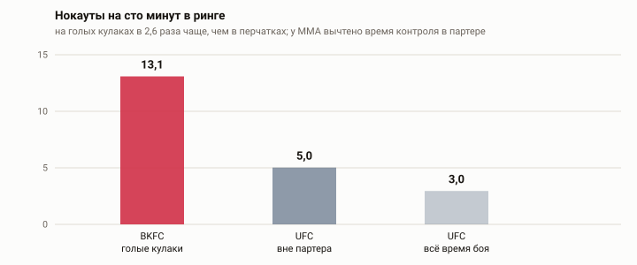
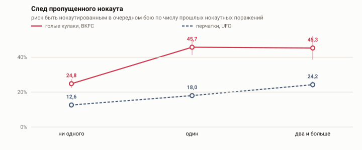
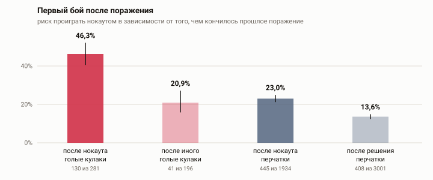

# Нокауты на голых кулаках

Перчатки ввели в 1867 году как меру безопасности. Возражение, которое с тех пор обсуждают в спортивной медицине: перчатка защищает кисть, а не мозг, и именно поэтому позволяет бить в голову чаще и сильнее. Промоушен BKFC ссылается на отчёты своих врачей у ринга и утверждает, что сотрясений и переломов кисти на голых кулаках меньше, чем в боксе и в ММА; этим аргументом лигу санкционировали в американских штатах.

Утверждение опирается на данные, которые собирает сама лига. Здесь оно проверяется другим способом — по тому, как часто в кулачке случаются нокауты и какой след они оставляют.

## Что получилось

1 723 боя BKFC на 164 турнира, 02.06.2018 — 11.09.2026. Для сравнения взят собственный разбор UFC: 8 630 боёв с 2001 года.

| | нокаутов на 100 минут | доля боёв с нокаутом |
|---|---|---|
| BKFC, голые кулаки | 13,1 | 65,8% |
| UFC, вне партера | 5,0 | 31,6% |
| UFC, всё время боя | 3,0 | |



Знаменатель здесь решает всё. Бой на голых кулаках идёт максимум пять раундов по две минуты, бой в UFC — пятнадцать минут, и сравнение по доле боёв (2,1 раза) меряет не то же самое, что сравнение по времени. Но и простое деление на время боя завышает разрыв: в ММА 41% времени уходит на контроль в партере, где ударов в голову почти нет. После вычета этого времени остаётся 2,6 раза — против 4,4 без вычета.

## След пропущенного нокаута

Разбор UFC показал, что нокаут работает как метка бойца: каждый пропущенный поднимает шансы следующего, а поражения другим способом не поднимают ничего. На голых кулаках та же конструкция повторяется и выходит сильнее.

| | оценка | 95% ДИ | p |
|---|---|---|---|
| замена поражения по очкам на нокаут | 1,85 | 1,54–2,21 | <0,001 |
| каждый пропущенный нокаут | 1,51 | 1,20–1,89 | <0,001 |
| то же, бутстрэп целых карьер | | 1,22–1,88 | |
| каждое поражение не нокаутом | 0,81 | 0,64–1,04 | 0,10 |
| то же, бутстрэп целых карьер | | 0,64–1,03 | |



Сырой риск растёт с 24,8% у тех, кого ни разу не роняли, до 45,7% после первого нокаута, и дальше стоит на месте (45,3%). По числу поражений другого типа он не растёт, а падает: 34,9%, 28,3%, 23,9%. Проигрывать не опасно — опасно проигрывать нокаутом.

## Первый бой после поражения

| прошлое поражение | боёв | нокаутов | риск | медианная пауза |
|---|---|---|---|---|
| нокаут | 281 | 130 | 46,3% | 233 дней |
| иное | 196 | 41 | 20,9% | 203 дней |



Отношение шансов 2,96 [1,93–4,54]; при равном числе прошлых нокаутов 2,28 [1,17–4,44]. Пауза не защищает: удвоение её длины даёт 1,17 [0,66–2,09], p = 0,59. Быстрее сорока пяти дней после нокаута возвращаются 0,4% бойцов, быстрее девяноста — 7,8%.

## Сильнее ли метка без перчаток

Обе выборки сведены в одну модель с взаимодействием по виду спорта. Ковариаты одинаковые и намеренно бедные: в карточках BKFC нет дат рождения, поэтому возраст не учитывается ни там, ни там. На данных UFC отказ от возраста меняет оценку с 1,205 на 1,214 — то есть почти ни на что.

| | оценка | 95% ДИ | p |
|---|---|---|---|
| каждый нокаут, в перчатках | 1,21 | 1,13–1,31 | <0,001 |
| во сколько раз сильнее на голых кулаках | 1,24 | 0,98–1,58 | 0,079 |
| то же, если брать UFC только с 2018 года | 1,26 | 0,98–1,61 | 0,067 |

Точечные оценки в двух спецификациях сходятся — 1,24 и 1,26, — но интервал накрывает единицу, и обычного порога значимости разница не достигает. Считать доказанным, что без перчаток метка глубже, нельзя. Что установлено твёрдо — метка там есть, она того же вида и не слабее.

## Проверки

| подвыборка | каждый пропущенный нокаут |
|---|---|
| вся панель | 1,51 [1,20–1,89] |
| без спорных победителей | 1,47 [1,17–1,85] |
| исход шире: плюс остановки врача | 1,52 [1,20–1,94] |
| только 2022 и позже | 1,50 [1,18–1,91] |
| тяжёлые категории | 1,49 [1,05–2,11] |
| остальные категории | 1,57 [1,19–2,09] |
| с третьего боя в BKFC | 1,40 [1,01–1,94] |

Поправка Холма на семейство из 4 гипотез: возвращение после нокаута <0,001, накопленный счётчик 0,001. Отрицательный контроль и пауза, как и должно быть, не проходят.

## Чего этот результат не значит

Сравнивается кулачный бокс с ММА в перчатках, а не с боксом в перчатках. Правильная пара для вопроса о перчатках — бокс, и его здесь нет: открытых данных о боксе с раундом и временем остановки я не нашёл. Пока сравнение отвечает на вопрос «кулачка против ММА», а не «перчатки против их отсутствия».

Дат рождения в источнике нет. В разборе UFC возраст был сильным предиктором, и здесь его не учесть; стаж в лиге — плохая замена, потому что половина бойцов BKFC провела там один бой. Оценка UFC без возраста почти не двигается, но гарантией для другой выборки это не является.

Счётчик нокаутов считает только бои в BKFC. Боец приходит туда из ММА или бокса с историей, которой в данных нет, и это занижает оценку, а не завышает.

Различить «урон накопился и порог опустился» и «порог всегда был низким, а нокаут его обнаружил» эти данные не позволяют — ровно как в разборе UFC.

Выше нокаутов в кулачке может быть не из-за голых кулаков, а из-за того, как этот спорт устроен: короткие раунды, ринг без сетки, линии схода в центре, отбор бойцов по манере драться. Отделить одно от другого на наблюдательных данных нельзя.

## Данные

Карточки боёв взяты из годовых статей английской Википедии «<год> in Bare Knuckle Fighting Championship» через API `action=parse&prop=wikitext`, лицензия CC BY-SA. Выгрузка лежит в `data_raw` и дальше не трогается.

Из 1 723 разобранных боёв в группу риска попадают 1 808 боёв — те, у кого в BKFC есть предыдущий бой и однозначный исход: 691 боец, 587 нокаутов, 32,5% на бой.

Сравнение с UFC берёт данные соседнего проекта [ufc-repeat-knockouts](https://github.com/PonomaryovPavel/ufc-repeat-knockouts): выгрузка ufcstats.com, время контроля в партере — оттуда же, из постраундовой статистики.

## Что пришлось чинить в источнике

Ссылки в списке турниров записаны то через пробелы, то через подчёркивания, а подпись ссылки не всегда совпадает с якорем и с заголовком секции. Даты стоят то шаблоном `{{dts}}`, то обычным текстом. Победитель отделён словом «def.», но часть строк записана через «vs.» — и это не только ничьи, так оформлены и обычные нокауты; в таких строках победителем считается записанный первым, строки помечены, и отдельная проверка показывает, что без них оценка не меняется. Время остановки местами записано как «5:00» при двухминутном раунде — опечатка, приведённая к концу раунда. Один бой вписан дважды, в основной кард и в прелиминари. Категория Ironweight не входила в список дивизионов, пока не появилась в данных 2026 года.

Замена точки на запятую в подписях графиков один раз прошла по всей разметке и сломала координаты SVG; теперь это ловит тест.

## Воспроизведение

Нужен Python 3.11 или новее.

```bash
pip install -r requirements.txt
./run.sh
```

Скрипты идут по порядку: разбор викитекста, панель бойцов, модели, сравнение с перчатками, графики, сборка этого файла, тесты. Числа в тексте подставляются из `data/results.json` и `data/compare.json` на последнем шаге.

## Лицензия

MIT для кода. Данные принадлежат английской Википедии и распространяются по CC BY-SA 4.0; выгрузка ufcstats.com — по условиям источника.

## Источники

- Годовые статьи «Bare Knuckle Fighting Championship» в английской Википедии, [пример за 2025 год](https://en.wikipedia.org/wiki/2025_in_Bare_Knuckle_Fighting_Championship)
- [Bare Knuckle Fighting Championship](https://en.wikipedia.org/wiki/Bare_Knuckle_Fighting_Championship) — регламент и история лиги
- Данные о травмах в кулачке, опубликованные лигой: [первая публикация](https://combatsportslaw.com/2020/11/24/data-reveals-bare-knuckle-boxing-has-lower-concussion-rate-than-gloved-fights/), [обновление](https://combatsportslaw.com/2021/08/16/study-updated-bare-knuckle-boxing-injury-data/)
- [ufc-repeat-knockouts](https://github.com/PonomaryovPavel/ufc-repeat-knockouts) — разбор UFC, откуда взято сравнение
